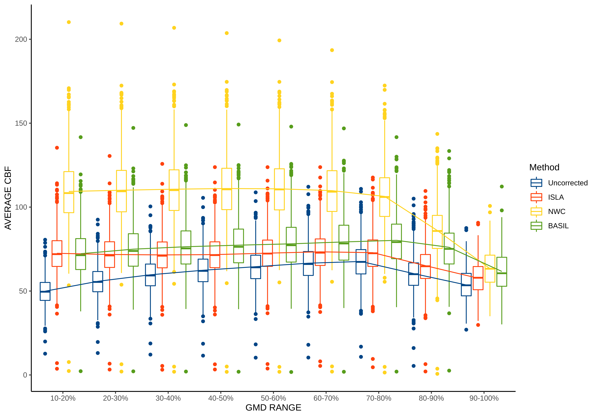

# ISLA Figures

The purpose of this repository is to produce data visualizations to compare ISLA, a novel statistical method for intermodal brain imaging, against competitor methods by leveraging the Philadelphia Neurodevelopmental Cohort (PNC; n≈1600). The code consits of pipelines to summarize brain measures at the voxel and ROI-level, in addition to notebooks for visualizing surface, roi-level and voxel-level information given multiple configurations of ISLA. 

## Surface projection and visualization

## P-value proportion per ROI barplots

## CBF by GMD range boxplots

